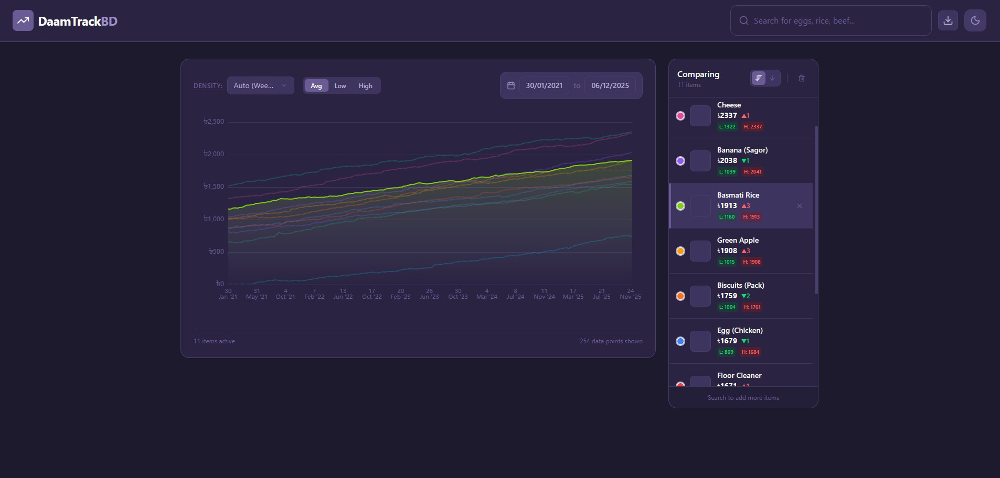

# Daam Track BD 🇧🇩

Daam Track BD is an open-source research project dedicated to tracking and visualizing commodity prices in Bangladesh over long periods. The goal is to build a transparent, historical record of daily necessities—such as rice, vegetables, fish, and other essentials—to analyze inflation trends and market volatility.



## 🚀 Live Demo
[Live Demo](https://matrixrex.github.io/Daam-Track-BD/)

## 🛠 Tech Stack

This project uses a modern, "serverless" architecture designed for high performance and zero-maintenance costs.

### Frontend
- **React**: UI library for building a responsive, interactive dashboard.
- **Vite**: Next-generation build tool for fast development.
- **Tailwind CSS**: Utility-first CSS framework for rapid, consistent styling.
- **Apache ECharts**: Powerful visualization library capable of rendering tens of thousands of data points smoothly (essential for 10+ year timelines).
- **DuckDB WASM**: An in-browser SQL OLAP database. It allows the frontend to query large, compressed Parquet files directly from the static server, enabling powerful analytics without a backend API.

### Data Pipeline & Scraper (Python)
- **Source**: Currently scraping [Chaldal.com](https://chaldal.com/) once daily.
- **Playwright**: Headless browser automation for robust scraping of dynamic e-commerce sites.
- **Pandas**: Data manipulation and cleaning.
- **Parquet**: The critical storage format. Data is saved in highly compressed, columnar Parquet files partitioned by year.

## 💡 Architecture & Workflows

### 1. Dual-Branch Data System
To prevent the main application repository from becoming bloated with daily data files, we use a **Dual-Branch Strategy**:
- **`main` branch**: Contains the application code (React, Vite, Scraper logic).
- **`database` branch**: Contains ONLY the result data (Parquet files, JSON metadata, images).

**How it works (Smart Merging):**
During the automated daily scrape (via GitHub Actions):
1. The workflow checks out the code from `main`.
2. It then checks out the `database` branch *into* the `/public` folder.
3. The scraper runs and writes new data into `/public/data`.
4. Since `/public` is tracking the `database` branch, the workflow simply commits and pushes these changes back to the `database` branch.
5. The `main` branch remains clean, while the App is able to fetch data via raw GitHub URLs pointing to the `database` branch.

### 2. Category Generation
The scraper relies on a `categories.json` file to know which URLs to visit.
- **`fetch_categories.py`**: This script navigates the specific structure of the target site (currently Chaldal) to discover all available product categories and generate the `json` mapping.
- *Note*: This logic is site-specific and will need adjustment if specific target sites change.

### 3. Development vs. Production Data
- **Production**: The app is hardcoded to fetch data from the remote `database` branch.
- **Development**:
  - By default, the app looks for local data in `/public/data` (which is gitignored in `main`).
  - **Fake Data Generator**: For local development, we use `generate_fake_data.py`. This script populates `/public/data` with 10 years of realistic synthetic data, allowing you to stress-test the charts without needing the massive real dataset.
  - **Data Toggle**: In dev mode, a "Use Remote Data" toggle appears in the UI. This allows checking the real production data without building the app.

## 📂 Project Structure

- `/src`: React frontend application.
- `/scraper`: Python scripts using Playwright.
- `/public/data`: (Gitignored in `main`) Location for local/fake data.
- `.github/workflows`: Actions for daily scraping and site deployment.

## 🏃‍♂️ Getting Started

### Prerequisites
- Node.js (v18+)
- pnpm (v8+)
- Python (v3.9+)

### Installation

1. **Clone the repo**
   ```bash
   git clone https://github.com/yourusername/daam-track-bd.git
   cd daam-track-bd
   ```

2. **Frontend Setup**
   ```bash
   pnpm install
   pnpm dev
   ```

3. **Generating Fake Data (For Dev)**
   Since the real data lives on a truncated branch, you need local data to see the charts work in dev mode.
   ```bash
   # Generates 10 years of synthetic history in /public/data
   python generate_fake_data.py
   ```

4. **Running the Scraper (Optional)**
   ```bash
   cd scraper
   pip install -r requirements.txt
   playwright install chromium
   
   # 1. Update Category List (Optional)
   python fetch_categories.py
   
   # 2. Scrape Prices
   python main.py
   ```

## 🤝 Contributing

Contributions are welcome! Whether it's adding new data sources, improving the categorization algorithm, or enhancing the chart visualization.

## 📄 License
MIT License - Free to use, modify, and distribute for any purpose.
